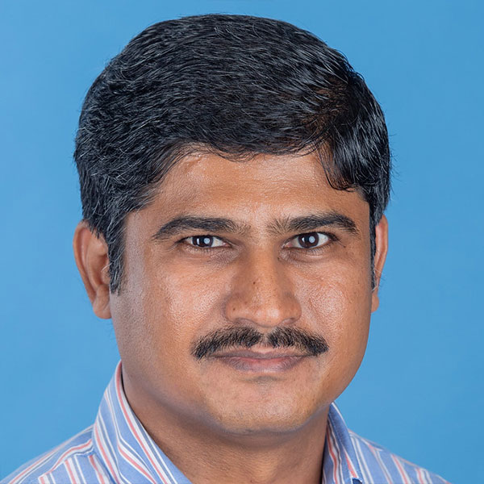

## About

Jaimin
Assistant Professor
S&E - Math/Statistics Sciences

Welcome to my homepage. I am a visiting assistant professor in the Department of Mathematics at UConn. Prior to this, I was a visiting assistant professor at the University of Maine. I completed my Ph.D in Mathematics under the supervision of Prof. Qingkai Kong from Northern Illinois University in 2017.

This year I am in the job market. I am looking for a tenure-track position in mathematical sciences. I am planning to consolidate all relevant information available via this website.

My research interests are in mainly in differential equations, primarily in boundary value problems and eigenvalue problems. I enjoy having conversations about mathematical and functional inequalities and their applications to differential equations. Lately, I started to explore some areas of mathematical physics and inverse problems. I am always happy to chat about my work and interested to know about my peers work. If you are interested, please feel free to to contact me. If you are a student and interested to work with me, please send me an email with your interest and background and we can have a conversation about that.

Beside mathematics, I enjoy hiking, rock climbing, and traveling. I have traveled to 35 states within the USA and I envision being a member of the 50 state club someday. I am a gastronomer and enjoy seafood the most (living in New England helps!). Italian and Japanese are two of my favorite cuisines- for me, distance is a mere number for fine cheese and delectable sushi! Other than the food, I am passionate about coffee, perfume, and single malt scotch. Cheers to that!

**I'll be on the job market starting in Fall 2021.** Please reach out if you think I'd be a good fit for your academic department or industry research group.

  

## News

<table style="width:100%">
  <tr>
    <td width="15%">Aug 2021</td>
    <td>Selected as a "Rising Star in EECS" by the <a href="https://risingstars21-eecs.mit.edu/">MIT EECS Rising Stars</a> workshop</td>
  </tr>
  <tr>
    <td width="15%">Aug 2021</td>
    <td>Giving a career advice talk on "Wandering with a Purpose" to the <a href="https://www.meetup.com/dair-ai/events/280146126/">Women in NLP</a> group</td>
  </tr>
  <tr>
    <td width="15%">Jun 2021</td>
    <td>Presenting our paper on seed terms for bias measurement at <a href="https://underline.io/events/167/sessions/5521/lecture/25462-bad-seeds-evaluating-lexical-methods-for-bias-measurement">ACL 2021</a> and at the <a href="https://genderbiasnlp.talp.cat/">Gender Bias in NLP Workshop</a></td>
  </tr>
  <tr>
    <td width="15%">Jun 2021</td>
    <td>Speaking on a book reviews panel and sharing a talk on "BERT for Humanists" at ACH 2021</td>
  </tr>
  <tr>
    <td width="15%">Jun 2021</td>
    <td>Interning at <a href="https://cortex.twitter.com/">Twitter Cortex</a></td>
  </tr>
  <tr>
    <td width="15%">May 2021</td>
    <td>Our paper <a href="https://maria-antoniak.github.io/resources/2021_acl_bad_seeds.pdf">Bad Seeds: Evaluating Lexical Methods for Bias Measurement</a> is accepted at ACL 2021</td>
  </tr>
  <tr>
    <td width="15%">Dec 2020</td>
    <td>Paper on Goodreads classics published at <a href="https://post45.org/2021/04/the-goodreads-classics-a-computational-study-of-readers-amazon-and-crowdsourced-amateur-criticism/">Post45</a> & <a href="https://culturalanalytics.org/article/22221-the-goodreads-classics-a-computational-study-of-readers-amazon-and-crowdsourced-amateur-criticism">Cultural Analytics</a></td>
  </tr>
  <tr>
    <td width="15%">Feb 2021</td>
    <td>Speaking at Microsoft's <a href="https://www.microsoft.com/en-us/research/event/aiandgaming2021/">AI & Gaming Research Summit</a> on self disclosure in online gaming communities</td>
  </tr>
  <tr>
    <td width="15%">Dec 2020</td>
    <td>Paper on <a href="https://maria-antoniak.github.io/resources/2021_cscw_librarything_genres.pdf">genre and LibraryThing book reviews</a> published at CSCW</td>
  </tr>
</table>

 

## Other Things

* I'm the current President of [Grads for Gender Inclusion in Computing](https://gsgic.org/) at Cornell. 
* I'm the current Webmaster (and former Social Chair and Treasurer) of [Graduate Women in Science](https://gwiscornell.wordpress.com/) at Cornell.
* In undergrad, I studied in the [Program of Liberal Studies](https://pls.nd.edu/), a reading-oriented set of tutorials and seminars, at the University of Notre Dame. I'm always happy to talk to students who are interested in transitioning from the humanities to technology.
* No relation (as far as I know) to [the other Antoniak](https://www.semanticscholar.org/author/C.-Antoniak/16645877) interested in the Dirichlet distribution.
* [books books books](https://maria-antoniak.github.io/reading)

   